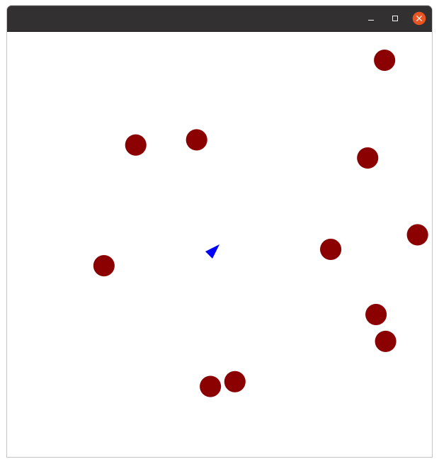

<h1 align="center"> Asteroides - Java Game</h1>

---

Asteroids era um jogo de arcade com gráficos vetoriais muito popular lançado em 1979 pela Atari.
     
Desta forma, na tentativa de reproduzir este clássico dos arcades "Asteroides - Java Game" apresenta o game, com sua simplicidade cativante e viciante. 
      

## 📝 Sumário

- [Sobre](#sobre)
- [Uso](#uso)
- [Contribuições](#contribuicoes)
- [Autor](#autor)
- [Conhecimentos](#conhecimentos)

##  Sobre 

Implementação do jogo Asteroids, famosa publicação do ATARI, programado em JAVA utilizando-se JAVAFX.

## 🎈 Uso 

Para jogar: utilize as teclas "ARROW LEFT" para movimentar a nave para a esquerda e "ARROW RIGHT" para movimentar a nave para a direita e a tecla "BARRA DE ESPAÇO" para atirar. 

## ✍️ Autor 

- [@Rodrigovvo](https://github.com/Rodrigovvo) 

## 🎉 Conhecimentos 
Foi utilizado [JAVA](https://www.java.com/pt-BR/) com a interface gráfica [JavaFX](https://openjfx.io/).

- Inspiração && Referências:
    [ Almas Baimagambetov](https://www.youtube.com/watch?v=l2XhUHW8Oa4&list=PL4h6ypqTi3RTIoPa_Qz3haEo3OXJQqOwc&index=7)
